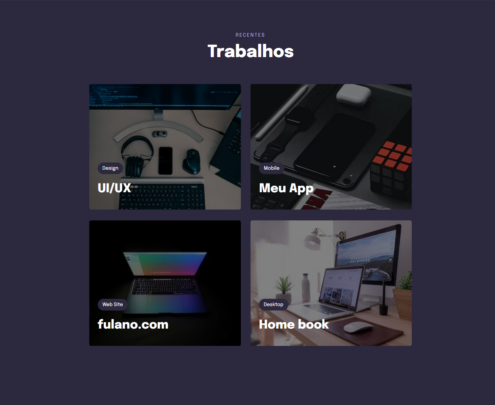

 

## 🖥️ Projeto 
Esse é um projeto Web Responsivo.

## 🚀 Tecnologias
Esse projeto foi desenvolvido na Rocketseat com as seguintes tecnologias:

- HTML
- CSS
- Git e Github

## 🏷️ Layout
Você pode visualizar o layoout do projeto através
[desse link](https://www.figma.com/file/Q5dO3pHAiqNScH1nD7mu8P/Explorer-Stage-03-Projeto-03-(Copy)?type=design&node-id=203-1925&mode=design&t=CXrgrIwgy0UMV0T2-0).
É necessário ter uma conta no [Figma](https://www.figma.com)